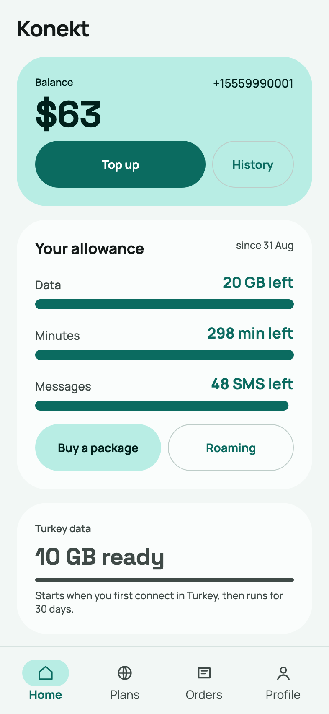
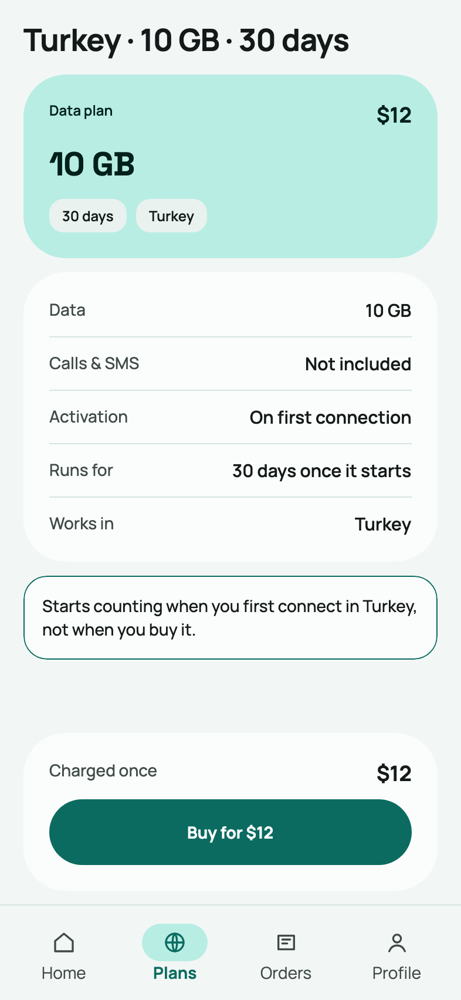
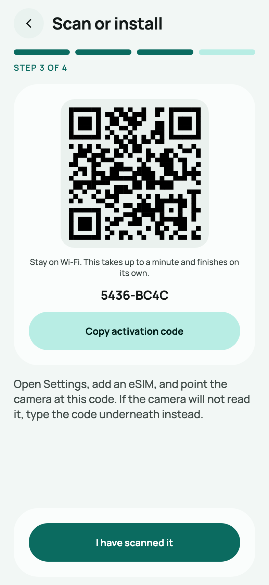
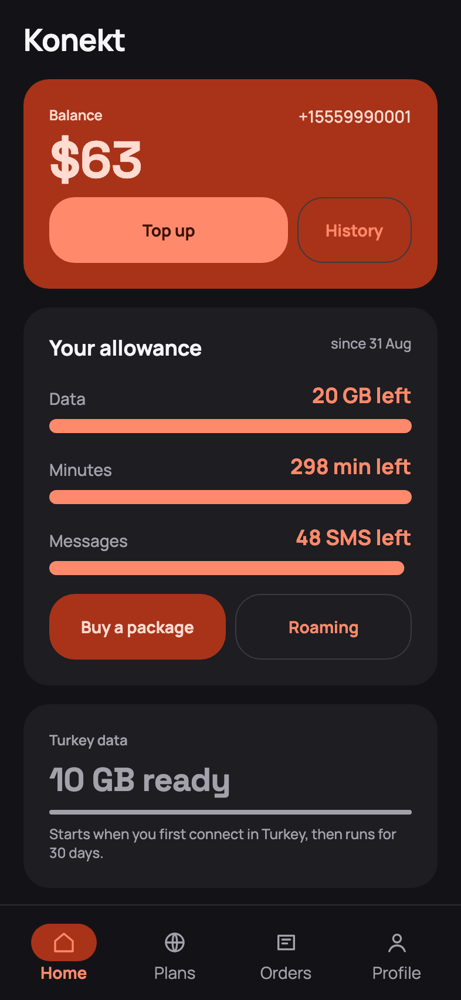

# konekt

**a reference implementation of six Kotlin toolkits, on the domain of an eSIM MVNO subscriber
account** — not a product an operator can deploy and sell service on. The telecom is the fixture; what
the stack costs to carry it is the subject.

> 📱 a new screen ships from the server; a new *kind* of screen ships with the client

  
  
  
  

The desktop client at phone size, on the recorded screens the goldens use, in the product's own typefaces. The fourth frame is the second brand kit in the dark theme — the same trees, a different server response. More in <a href="docs/screenshots/">docs/screenshots</a>, both themes.

### 🤔 What it is

The product is real enough to photograph — balance and quotas, plans and packages, ordering and
installing an eSIM, roaming, history — and everything outside its boundary is mocked on purpose: the
billing system, the SM-DP+ that issues eSIM profiles, the payment gateway, the SMSC that would carry
an OTP. There is also no management surface, no catalogue anyone edits without a deploy, no seam
under the billing and no second tenant — and none of those is a to-do. A domain that loads the
toolkits honestly is the whole requirement; building past it would produce a worse version of a
product several vendors already sell. Each absence, with its reason and with what would end it, is
[reference-scope](docs/services/reference-scope.md).

What is not mocked is the wiring. Six Kotlin toolkits each carry the load they were written for, on a
domain that loads them without contrivance:

| | |
|---|---|
| [kompot](https://github.com/youndie/kompot) | the whole UI contract: the server describes a screen, the client renders it |
| [petich](https://github.com/youndie/petich) | every operation that moves money, with compensation and a confirmation that expires |
| [booblik](https://github.com/youndie/booblik) | the event bus between the server and its consumers |
| [tracy](https://github.com/youndie/tracy) | structured logs and traces, keyed by `msisdn`, `iccid` and `orderId` |
| [metrik](https://github.com/youndie/metrik) | latency, errors and deploy markers |
| [katcher](https://github.com/youndie/katcher) | crashes — wired into the iOS client today, and see the platform table below |

One purchase runs through a kompot form, a petich saga, the outbox, booblik and back to an open
screen over the realtime channel — and is visible whole in tracy by its order id.

Two things are written down beside the code, and they are the reason to read this rather than a
sample application. **What each toolkit costs**: 17 database writes for a six-interceptor saga, a
client release for a corner radius, a broker restart for a topic. And **the failures a green build
does not show**, each with the guard that now catches it: petich dropping outbox events silently, a
conformance kit passing vacuously, an Apple target nobody published.

### 🚧 Status

**Built.** The server, the saga, the broker bridge, the realtime channel and the eSIM wizard are in
and driven end to end by a docker-compose stand; a tagged image deploys to a test contour by Helm
and is checked there after every release. The Compose client runs on the desktop, on an Android
device and in the iOS simulator, and draws every screen the way the canvas draws it — matched screen
by screen against the real frames, with the differences kept on purpose written down
([B-114](docs/backlog/B-114-the-client-does-not-look-like-the-canvas.md),
[B-115](docs/backlog/B-115-the-esim-install-flow-does-not-look-like-the-canvas.md)). What remains
open is presentation, not product: the purchase confirmation as a sheet over the plan page
([B-116](docs/backlog/B-116-the-confirmation-is-a-screen-not-a-sheet.md)). Everything else is in
[backlog.md](backlog.md), item by item, with the reason attached to each — and the ones stopped on a
stated cause say what the cause is rather than sitting in a list of the unfinished.

- [docs/research/research-architecture.md](docs/research/research-architecture.md) — what was read in
  the six toolkits, each fact with the artefact it was read in, and the decisions and deviations that
  followed;
- [docs/research/research-upstream-proposals.md](docs/research/research-upstream-proposals.md) — the
  gaps found in them, filed as issues, with what came back;
- [docs/design/design-app-canvas.md](docs/design/design-app-canvas.md) — the interface design and the
  component dictionary it commits the build to;
- [docs/features/](docs/features), [docs/screens/](docs/screens), [docs/api/](docs/api) and
  [docs/services/](docs/services) — the layers, written from the code rather than from intent.

### 👁 What is observed, and on which platform

Stated as a table because "we have crash reporting" is the sentence that hides which half of a
product is silent — and this one was silent in three different places for three different reasons, none
of which a local test could have found.

| | Server (JVM) | client (iOS) | client (Android) | client (desktop) |
|---|---|---|---|---|
| crashes (katcher) | **delivered** — a route that throws is reported and shows in katcher | **delivered** — a simulator crash arrives naming its release | **not delivered**, and the reason is upstream — see below | breadcrumbs only |
| logs and traces (tracy) | **delivered** — a purchase is findable by `orderId` | **delivered** — a screen the client cannot draw is findable by wire type | same as iOS | same as iOS |
| latency and errors (metrik) | **delivered** — latency per route | — | — | — |

"Delivered" is a stronger word than "wired" on purpose: every row above was measured at the COLLECTOR
after driving the product, not at the agent's configuration. That distinction is the whole reason for
this table — all three of these libraries answer a missing key, a missing endpoint or an unreachable
collector by doing nothing, so a deployment that meant to be observed and is silent looks exactly like
one that is working, from inside.

Each row cost something different to reach. tracy published no Apple target until
[tracy#16](https://github.com/youndie/tracy/issues/16); katcher published none until
[katcher#25](https://github.com/youndie/katcher/issues/25); and the server's katcher was correctly
configured and structurally unable to receive anything, because `StatusPages` catches every route
exception before an uncaught-exception handler could run.

The remaining blank is metrik on the client, which measures route latency and has no routes to
measure there.

**Android's row says "not delivered" rather than nothing, because it was tried and measured.** A
deliberate crash on a Pixel 6a fires the hook, reaches katcher's own handler, and fails at the last
step: katcher's multiplatform client publishes no android variant, so the build resolves the JVM one,
whose report cache is fixed at `System.getProperty("user.dir")` — `/` on Android, unwritable, and a
property Android refuses to let an application change. The other artefact, `client-android`, declares
the same type in the same package and cannot share a classpath with the one the shared code compiles
against. Filed as [katcher#27](https://github.com/youndie/katcher/issues/27); the crash harness is
kept so the day it is fixed is a run rather than a rewrite.

### 🎨 The rebrand, as a demonstrated property

A second brand's palette ships from the server and the client applies it without a rebuild — that
much is built and photographed. It is worth stating precisely what it covers, because the boundary is
not where it is usually assumed to be:

| Axis | Ships as |
|---|---|
| colours and every string | a server response — **no client rebuild**; a new kit is a server deploy |
| the type scale — sizes, weights, letter spacing | the same way, and no kit here carries one yet — the client's own scale is the canvas's |
| the font family | **a client release** — Manrope and Space Grotesk ship inside the client as static instances; the wire's text style has no family, so a face a server named would not arrive |
| screens, layouts, flows | a server response — no rebuild |
| the shape scale (corner radii), and how tall a control is | **a client release** — the wire has no vocabulary for shape or size, deliberately |
| a new kind of component | **a client release** — the dictionary is the API |
| icons in the interface | a server deploy — an icon travels as path data on a 24-grid and the client colours it; what an unknown icon degrades to is written down per control |
| a new event topic | a broker restart — booblik fixes its topics at startup |

The reasoning behind each row is in the research, §1.2, §1.5 and §1.8. The full version — what is a
variable, what is a deploy, what is a release an operator does not control — is
[operator-boundaries](docs/services/operator-boundaries.md).

### 📄 License

MIT.
