# B-114 — As it is, beside as it should be

Reported from the running desktop client: *the result does not match the design.* This item is the
comparison, done screen by screen with the real application beside the real canvas, and the list of
what has to move. It is the parent of the fixes; each fix worth its own item gets one and links here.

## How the comparison was made

- **The application**: the desktop client at **393×852** — `KONEKT_WINDOW=393x852`, added to `Main.kt`
  for this — against the test deployment on `v0.1.33`, signed in as a subscriber with a balance, three
  live counters and a roaming package. Every frame is a screenshot of that window, not a golden.
- **The design**: `docs/design/konekt-esim-app.dc.html`, the imported *Konekt eSIM app* canvas. Each
  393×852 artboard was cut out and rendered on its own with the canvas's typefaces (Manrope, Space
  Grotesk). The live claude.ai project was not reachable from this session, so the imported copy is
  the reference; `support.js` is the canvas runtime and the artboards render without it.
- **Dark mode** is the committed golden `AppFrame_App_home_Dark.png`, because the recording it is
  drawn from is a real server response and the client that drew it is the current one.
- Frames live in `docs/design/audit-2026-09-02/` — `app/` is what is, `design/` is what should be.

## What is deliberately NOT on the list

Settled elsewhere, and re-listing it would relitigate a decision:

| In the canvas | Why it stays different |
|---|---|
| ₽ amounts, `+7 999…` numbers, Russian-locale figures | the product runs in `Currency.DEFAULT` and English; localisation is a non-goal ([reference-scope](../services/reference-scope.md)) |
| `Smart 20 · renews 12 Sep` over the counters | there is no subscription — an allowance is bought once ([design-app-canvas](../design/design-app-canvas.md)) |
| the avatar chip with initials, the bell | no name to take initials from ([B-55](B-55-home-header.md)); no notifications exist |
| Card ···4417 as a way to pay, Payment methods, Auto top-up | no card details anywhere ([B-40](B-40-no-way-to-add-money.md)) |
| Appearance and Language rows | dark mode is a client setting, deliberately; language is a non-goal |
| the roaming package as a compact row with `Install` | drawn as a counter card on purpose — it carries the quota the row does not ([design-app-canvas](../design/design-app-canvas.md)) |
| the search field and country chips on the catalogue | the catalogue has four plans; travel is grouped by zone on its own screen |

## Across every screen

These are not per-screen defects; fix them once and every frame below moves.

| | As it is | As it should be |
|---|---|---|
| **G1 — Typeface** | the platform sans (SF on the Mac) everywhere | **Manrope** for UI text, **Space Grotesk** for figures — the balance, prices, codes, ICCIDs. The canvas's whole texture is these two faces; nothing below reads right without them. Fonts are compiled into the client (operator-boundaries: a client release) |
| **G2 — Ground and card** | page ground is near-white, cards are the tinted `surface_variant` | the canvas is the other way round: a light mint-grey page (`#EEF4F2`) with **near-white cards** (`#FAFDFC`). The inversion is why every app frame looks flat beside its reference even where the layout matches |
| **G3 — Bottom bar** | selected tab is coloured and bold; icons and labels sit on a plain bar | the selected tab sits in a **tonal pill** (`primary_container`, 48 tall); labels are 11.5px medium; icons 24. The bar itself has a top rule and no radius on the phone (the canvas draws it edge to edge) |
| **G4 — Back control** | `← Back` as a text link at the top left | a **round chevron button** (44, `surface_variant`) beside the screen title, on the same line; a screen with a back control keeps its title |
| **G5 — Titles** | regular weight, ~28px | Manrope **700**, 24–26px, with the letter-spacing the canvas has; sub-labels (`Sent to`, `Balance`) are 11.5–12px medium in `on_surface_variant` |
| **G6 — Buttons** | 44 tall, 600 weight | primary pill **56 tall**, 700 weight; the secondary is a white pill with a 1.5px outline, same height |
| **G7 — Progress bars** | Material's linear indicator: a track with a **stop dot** at the end | a two-segment pill — filled part, 5px gap, light remainder — 12px tall, no dot. Visible on every counter, on the home card and on the orders card |

## Screen by screen

### Sign in

| As it is | As it should be |
|---|---|
| 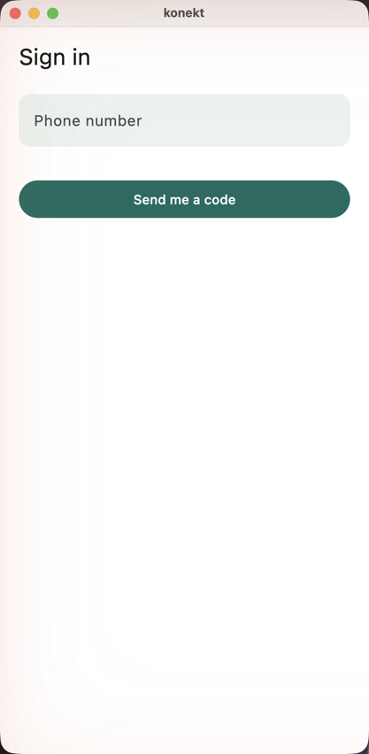 | 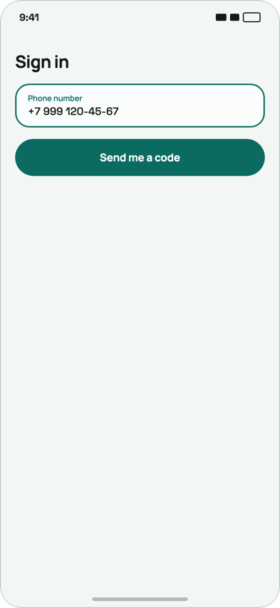 |
| 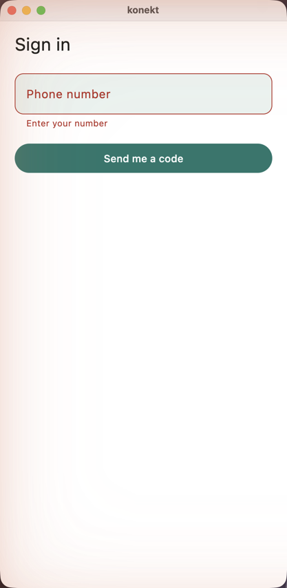 | 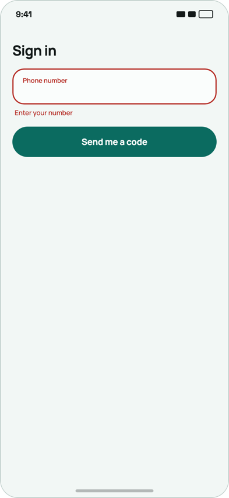 |

- The field is **outlined** on a white ground with a floating green label, not a filled tinted box.
- The error state is right in structure (red outline, `Enter your number` under the field) — it needs
  only the outlined field and G1/G6.

### Enter the code

| As it is | As it should be |
|---|---|
| 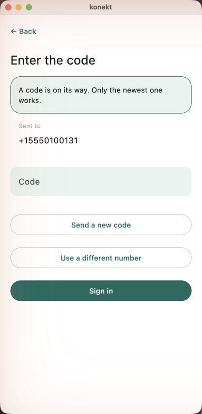 | 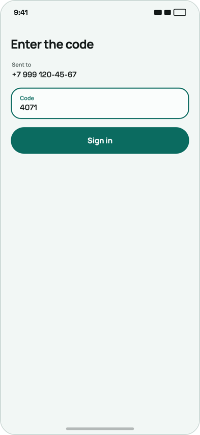 |
| 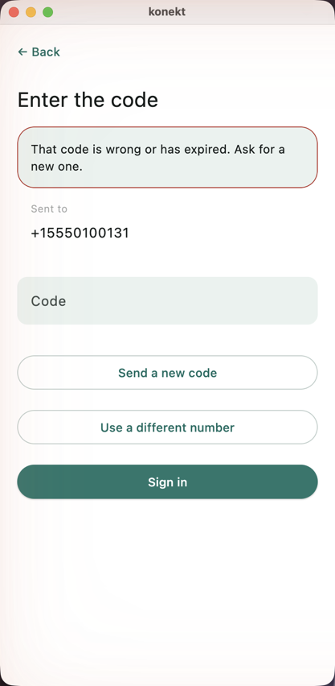 | 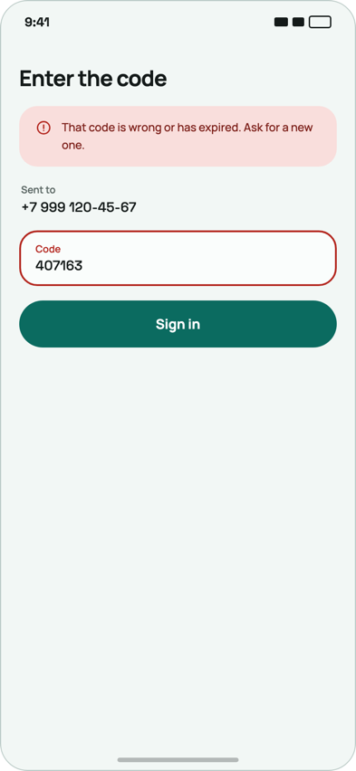 |

- **No banner in the ordinary state.** The canvas shows `Sent to` + number, the code field and
  `Sign in`; the green *A code is on its way* box is ours and it pushes the field down.
- The wrong-code refusal IS a red banner at the top plus a red field outline — the app has the banner
  and lacks the outline.
- `Send a new code` and `Use a different number` are **not two outlined buttons above Sign in**. The
  canvas's variant carries `Resend this code · in 0:42` as a text row under the field; the way back
  to the number is the back control. Sign in should be the first and only pill.
- The field: outlined with a floating label, figures in Space Grotesk.

### Home

| As it is | As it should be |
|---|---|
| 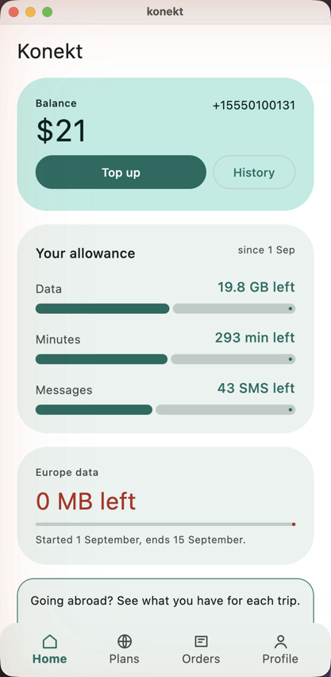 | 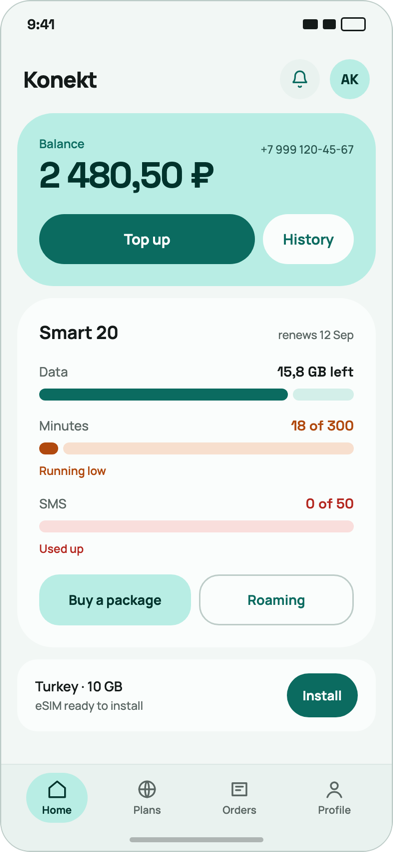 |
| 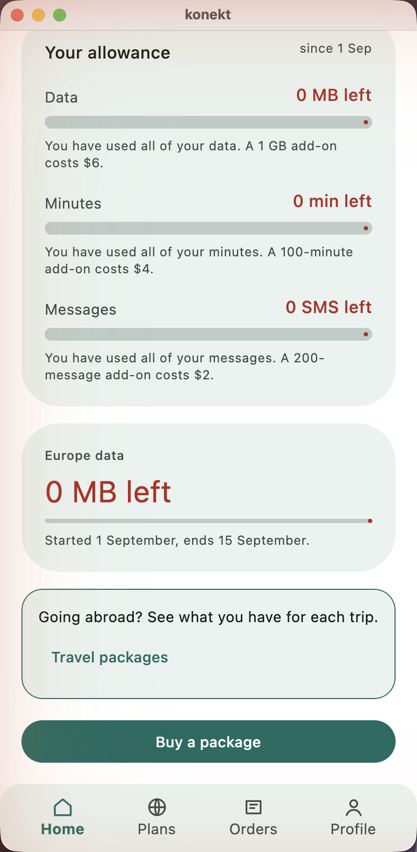 | 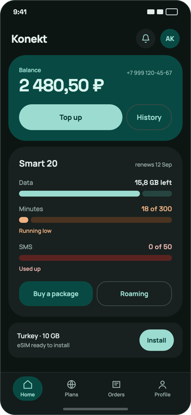 *(dark, for the layout of the lower half)* |
| 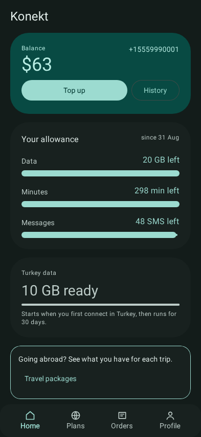 |  |

- The balance figure is Space Grotesk at **44px**; ours is smaller and in the platform face (G1).
- **`Buy a package` and `Roaming` belong inside the allowance card**, as a pair under the counters — a
  tonal pill and an outlined pill. Ours are a full-width primary at the bottom of the page and a
  banner with a link, two different controls for what the canvas draws as one row.
- The low and exhausted states carry a **short state word** under the bar — `Running low`, `Used up` —
  and the figure itself turns orange / red. Ours writes a sentence with the add-on price. `B-60` chose
  the sentence deliberately, so this is a decision to take rather than a bug: the canvas puts the
  add-on offer on the plan-usage detail screen as a button (`Add 100 minutes`), not in the caption.
- The bars: G7. The stop dot is the most visible single defect on this screen.
- Card grounds: G2 — the allowance card should be near-white on the mint page, not tinted on white.
- Dark mode has the same list; in addition the canvas's dark cards are `#18211F` on a `#0F1614`
  ground, and the balance card keeps its mint tint at reduced saturation.

### Plans

| As it is | As it should be |
|---|---|
| 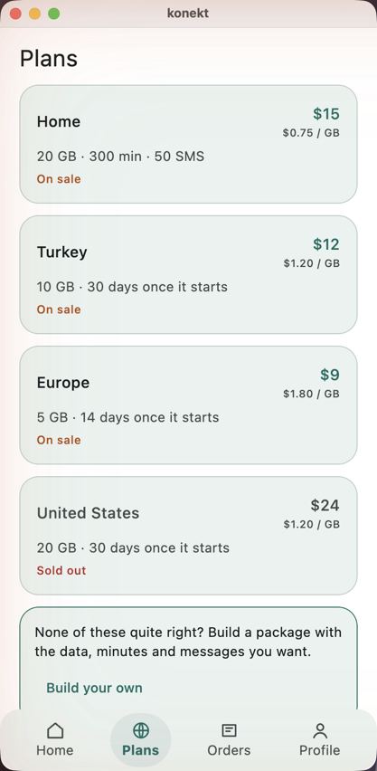 | 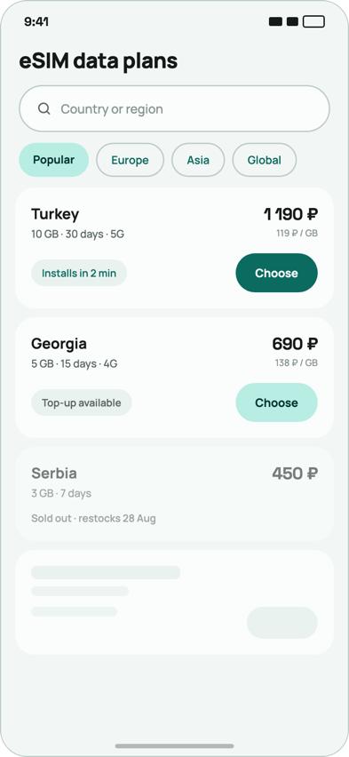 |

- A plan card has a **`Choose` pill on the right** and a **tag chip** on the left (`Installs in 2 min`,
  `Top-up available`); the whole card is not the only press target.
- `On sale` in orange under every card is **not in the canvas** and reads as a warning. Availability is
  expressed the other way round: only the sold-out card says anything, and it is **greyed** — title,
  price and quota in `on_surface_variant`, `Sold out · restocks 28 Aug` as the tag.
- The per-GB price sits under the price in 11.5px (ours has it — keep).
- Title is `eSIM data plans` in the canvas; ours says `Plans`. A copy decision, not a defect.
- The travel screen (`10-travel.png`) uses the same card and inherits every fix here.

### Plan detail

| As it is | As it should be |
|---|---|
| 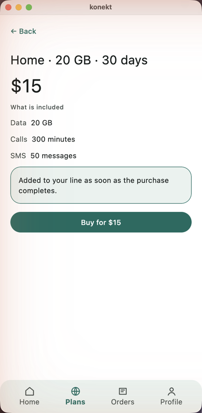 | 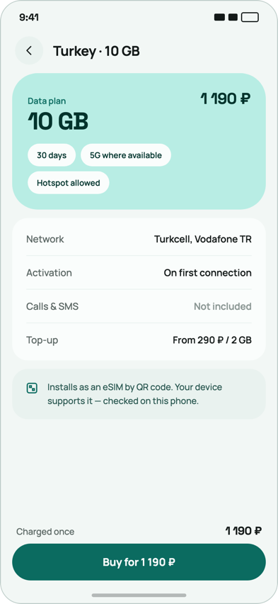 |

- The top is a **mint hero card**: `Data plan` label, the quota huge (`10 GB`, Space Grotesk 44), the
  price top-right, and **attribute chips** (`30 days`, `5G where available`, `Hotspot allowed`). Ours
  is a plain title line and a price.
- What is included is a **white table with dividers** — `Network`, `Activation`, `Calls & SMS`,
  `Top-up` — labels left in `on_surface_variant`, values right. Ours is three label/value pairs with
  no rule between them and no card.
- The QR-install note is an info banner with an icon; ours has the banner without the icon.
- **The buy button is pinned to the bottom** with `Charged once` and the price on the line above it.
  Ours puts `Buy for $15` immediately under the content, a third of the way down an empty screen.
- Back control: G4 — chevron beside `Turkey · 10 GB`, not `← Back` above it.

### Confirm purchase

| As it is | As it should be |
|---|---|
| 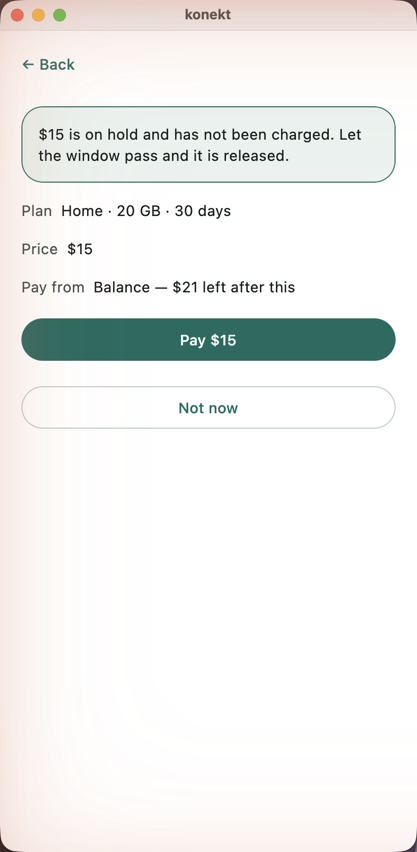 | 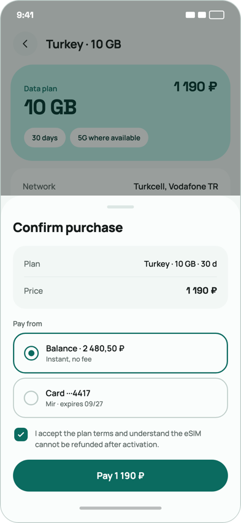 |

- The canvas presents this as a **bottom sheet over the plan detail** with a drag handle. That is a
  presentation change and can come last; everything else applies to a full screen too.
- **A title**: `Confirm purchase`. Ours opens on the hold banner with no heading.
- Plan and price in a **tinted two-row table**, labels left, values right and bold.
- `Pay from` as a **selected radio card** — `Balance · $21 · Instant, no fee` with the check filled.
  Only balance exists here (`B-40`), so it is one card and it is selected; it still needs to look like
  a chosen option rather than a line of text.
- The consent checkbox and its sentence are in the canvas and absent here; the hold banner is here and
  absent in the canvas. Both are product copy decisions — the banner's fact (nothing charged until the
  window passes) is true and worth keeping, but as the sentence under the pay button, not as the first
  thing on the screen.
- `Not now` as a text link, not an outlined pill of the same size as `Pay`.

### Purchase result

| As it is | As it should be |
|---|---|
| 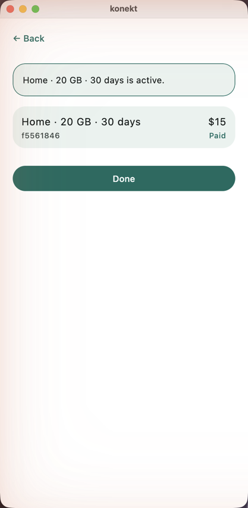 | 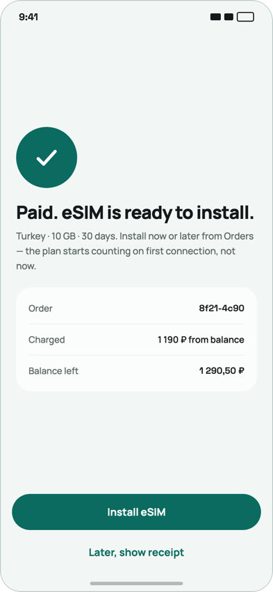 |

- **A big check mark** in a primary circle, then a headline — `Paid.` — then one explanatory paragraph
  in `on_surface_variant`. Ours is a bordered banner reading like a system message.
- **A receipt table**: `Order`, `Charged … from balance`, `Balance left`. Ours shows the order row with
  `$15 · Paid` and nothing about the balance after.
- The primary action is the next thing to do — `Install eSIM` for an eSIM plan, `Done` for a home
  allowance — and the secondary is a **text link** (`Later, show receipt`), not a second pill. Ours
  has `Done` as the only control, which is right for the home plan; the eSIM plans should offer the
  install here. The order-detail screen reached from Orders is this same screen and has **no bottom
  bar**, so from it there is no way to a tab except `Done` — worth its own look.
- The refusal frame (`10.png`) has the same shape with a red icon and a **reversed / balance / reference**
  table; ours (`B-68`) has the sentence and the control and none of the table.

### Orders

| As it is | As it should be |
|---|---|
| 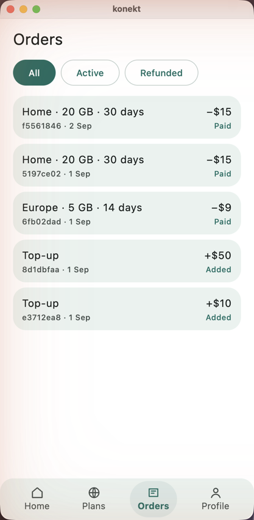 | 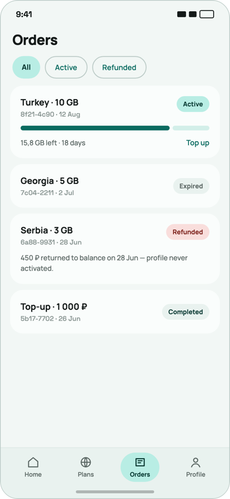 |

- Status is a **chip on the right** — `Active` mint, `Expired` grey, `Refunded` red-tinted,
  `Completed` grey — not a word in small text under the amount.
- An **active package card carries its bar and remainder** — `15,8 GB left · 18 days` — with `Top up`
  as a link on the right. That is data the orders screen does not have today (it lists ledger rows);
  the canvas treats an order as the package it bought. A model question before a layout one.
- A refunded order **explains itself** in a sentence on the card; ours has the status word only.
- The signed amounts (`−$15`, `+$50`) are ours and not in the canvas; they are useful and can stay
  on the second line in the mono face.
- Filter chips: ours are outlined pills of one size; the canvas's selected chip is a tonal pill and the
  rest are outlined, all 40 tall.

### Profile

| As it is | As it should be |
|---|---|
| 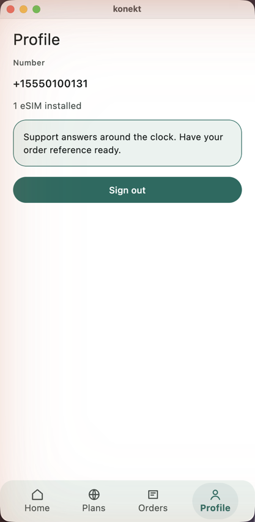 | 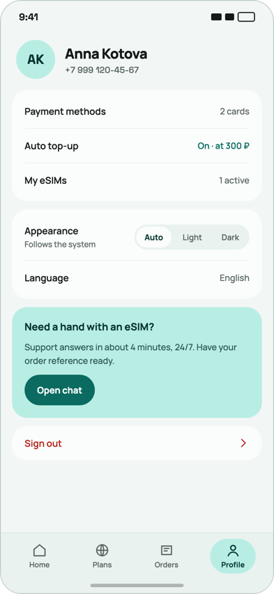 |

- The header is **avatar + name + number**. No name and no initials exist (`B-55`), so the honest
  version is the number as the title with the label above it — but styled as the canvas styles the
  header, not as a `Number` caption over a body-sized figure.
- What the line holds is a **settings list in a white card with dividers**: `My eSIMs · 1 active` as a
  row with a value on the right. Ours is a line of body text.
- The support notice is a **mint card with a heading and a button**; ours is a bordered banner of body
  text. There is no chat, so the button is not `Open chat` — but the card can still be the card.
- **`Sign out` is a red text row with a chevron at the bottom of the list**, not a full-width primary
  pill. A primary pill for leaving is the most prominent control on the screen.

### Screens the canvas does not draw

| Screen | Frame | What applies |
|---|---|---|
| Travel packages | `10-travel.png` | G1–G7 and every plan-card fix; the zone heading and the held package are ours and fine |
| Top up | `11-topup.png` | G1, G4, G6; the field as on Sign in; the helper `Between $10 and $50,000.` as the field's supporting text, not a paragraph |
| Build your own | `12-custom-package.png`, `12-custom-package-chosen.png` | our extension (`B-104`): the slider's **thumb is a tall vertical bar** and the track is salmon — neither is in the brand. A round thumb in `primary`, the active track in `primary`, the rest in `primary_container`, ticks as small dots; the price/balance pair as a two-row table like the confirm screen |

## The order to do it in

1. **G1, G2, G3, G7** — the typefaces, the ground/card inversion, the bar and the bars. Four changes
   in the client's design system and every frame moves toward the canvas at once. Photograph before
   and after; this is the change most likely to make a screen look *worse* in one place while fixing
   nine, and that place needs to be seen.
2. **Plan detail and purchase result** — the two screens furthest from their references, and the ones
   a subscriber sees when they are about to spend money.
3. **Home** — the button pair into the card, the state words (a decision first).
4. **Plans / travel**, **orders**, **profile**, **sign in / code**.
5. The confirm sheet as a sheet, last.

## Progress

### Block 1 — the systemic seven, done

| | What landed |
|---|---|
| **G1** | Manrope and Space Grotesk bundled as Compose resources, cut into **static, unhinted** instances per weight with vertical metrics equalised; `KonektTypography` is the one type scale and `KonektTheme` hands it to `MaterialTheme`, which is where kompot resolves every token from. `display*`/`headline*` are figures, everything else is text |
| **G2** | the frame paints `background`, cards paint `surface`, chips keep `surface_variant`; brand A's `surface` is the canvas's `#FAFDFC`. The kit always carried both — the client used the wrong two tokens |
| **G3** | the bar sits on the page with a hairline in `outline_variant`; the current tab in a `primary_container` pill |
| **G4** | a 44-point circle in `surface_variant` with a stroked chevron, drawn by the same glyph the tab icons use. On its own line: the title is the server's and this frame does not read it |
| **G5** | screen titles 26/700, `title_medium` 18/700, labels 600 — the canvas's numbers, mapped onto the tokens the server already sends |
| **G6** | weight 700 on `label_large`; **the height is not ours** — buttons are kompot's renderer, so 56 needs either a konekt override of that registry entry or an upstream ask. Left open here |
| **G7** | two-segment pill, five-point gap, no stop dot; the remainder tinted in the state's own container (peach on low, pink on exhausted) rather than one mint track |

**What the fonts cost, measured.** With the platform face, a frame recorded on a Mac and verified on the
Linux runner differed by 4–8% of its pixels. With the variable files bundled, 0.07–0.26%. With static
instances, 0.07–0.08% — and dehinting changed not one pixel, so it was never hinting. What is left is
single glyphs of 12sp text whose sub-pixel position the two platforms round differently.

**The goldens therefore keep viddik's family.** `viddikTypography(KonektTypography.material)` — every
size and weight the product decides, on the Roboto viddik pins — is what the screenshot harness hands
to `KonektTheme` and to `KonektApp`, which builds its own theme and had been overriding the harness's.
A golden photographs the layout, not the typeface; the face is checked against the canvas by eye. The
per-channel tolerance that was widened to admit the drift went back to its default once nothing needed
admitting, and a one-point inset change fails at 4–7.6%, measured by mutation.

**G6 is upstream.** `KompotSurface` carries shape, colours and a text style and nothing about size, so
a design system can make a button a pill and cannot make it 56 tall — filed as
[youndie/kompot#106](https://github.com/youndie/kompot/issues/106) with the smallest contract change
that keeps appearance off the wire.

**Not touched in this block, on purpose:** the state words under the bars (a decision for block 3) and
the chevron sharing a line with the title (needs the frame to know the title).

### Block 2 — plan detail and the purchase outcome, done

Three things went on the wire, priced in [operator-boundaries](../services/operator-boundaries.md):
`surface` grew `density` (`card`/`chip`), `dividers` and `pinned`; the dictionary grew `icon` — a
`VectorIcon` in a disc, coloured by tone. Everything else is the client's: the chip's 11-point corner
(`CardGeometry.Tier.CHIP`), the hairline between rows, and where a pinned surface sits —
`withoutShell()` pulls it out of the tree the way it pulls the bar, and `KonektApp` draws it above
the bar outside the scroll. Written after a frame showed the footer in place: the shell pulled the
bar and nothing pulled the footer, and `PinnedFooterLeavesTheScrollTest` is the seam that says so.

| Screen | What landed |
|---|---|
| **Plan detail** | title; a hero in the `accent` tone — label and price on the head row, the quota as the `headline_medium` figure, validity and zone as chips; a white table of what is included; the activation note; `Charged once` with the price and the buy button pinned above the bar. The sold-out plan keeps its banner and gets no footer |
| **Purchase outcome** | a check or a cross in a disc, `Paid.` / `Payment failed.` as the headline, one paragraph, and a receipt table. The refusal keeps its five sentences — each still ends in "nothing was charged", and the tests that read them now read the paragraph rather than a banner |

The three fixtures (`plan-detail-screen`, `order-screen`, `order-refused-screen`) were re-recorded
from the stand through the API, and the conformance walk caught the first draft: the `Activation`
row of the table and the activation banner had been given the same id.

**Not touched in this block, on purpose:** the confirm sheet (last, per the order above) and the
button height (kompot#106).

### Block 3 — home, done

**The state words were a decision, and it went: the word AND the offer.** The canvas writes
`Running low` / `Used up` under the bar and colours the figure; `B-60` had chosen a sentence with the
projection and the add-on's price, and the canvas puts that offer on a plan-usage screen this build
does not have. Dropping the offer would have removed the only place the price list is visible, so the
caption is now the word first and the two clauses behind it — *"Running low · minutes run out in
about two days · Add 100 min for $4"*, *"Used up · Add 200 SMS for $2"* — drawn by the client in the
state's colour. Shorter than the sentences, and nothing `B-60` chose is gone.

| | What landed |
|---|---|
| **The pair** | `Buy a package` (a new `tonal` emphasis — `primary_container`, named in `ButtonEmphasis` and drawn by `KonektDesignSystem`) and `Roaming` (`quiet`) in one row under the counters, inside the allowance card. They were a full-width primary at the foot of the page and a `Travel packages` banner — the same two doors in two other shapes. The pill opens the travel screen the banner did, always, which is what `B-88` learned from the reachability guard |
| **The captions** | the word, the projection, the offer, as clauses; in the state's colour |
| **The eSIM row** | left as a banner, deliberately (see the list at the top) — the canvas's compact row with `Install` is the card without the quota |

Priced in [operator-boundaries](../services/operator-boundaries.md): a new emphasis word is a client
release, and a client without it draws its ordinary button.

## Acceptance criteria

- AC: every screen above has a golden at 393×852 in **both** themes, re-recorded from the server after
  the server-side changes, and read against its reference rather than accepted.
- AC: the deliberate differences listed at the top are still different afterwards — matching the
  canvas is not the same as copying it.
- AC: each fix that changes the wire (a new chip, a `Choose` action, a receipt table) is priced in
  [operator-boundaries](../services/operator-boundaries.md) as it lands.
- AC: `design-app-canvas.md` is updated where a screen's description no longer matches what is drawn.

## Anchors

| What | Where |
|---|---|
| The frames | `docs/design/audit-2026-09-02/` |
| The canvas | `docs/design/konekt-esim-app.dc.html`, [design-app-canvas](../design/design-app-canvas.md) |
| The window size switch | `client/src/jvmMain/kotlin/io/konekt/client/Main.kt` — `KONEKT_WINDOW` |
| The design system | `client/src/commonMain/kotlin/io/konekt/client/theme/`, `client/src/commonMain/kotlin/io/konekt/client/render/CardGeometry.kt` |
| Where the tabs and cards were last moved | [B-105](B-105-the-home-screen-diverges-from-the-canvas.md), [B-110](B-110-the-tabs-have-no-icons.md), [B-112](B-112-the-cards-do-not-use-the-canvas-geometry.md) |
