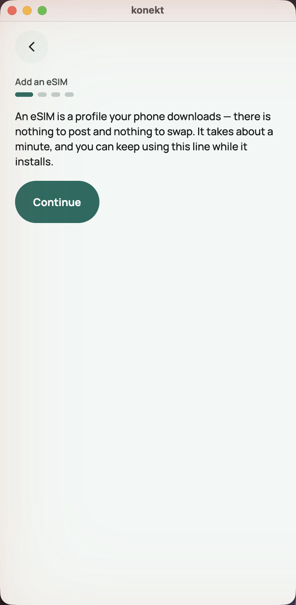
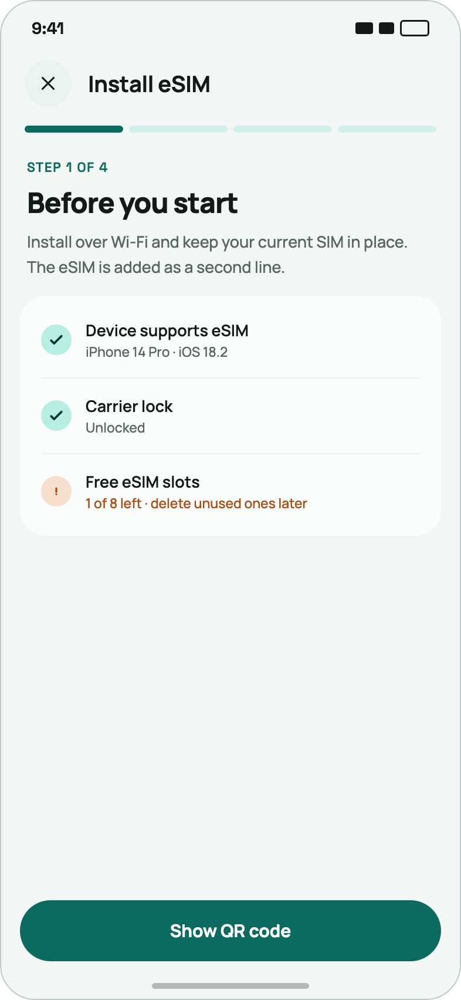
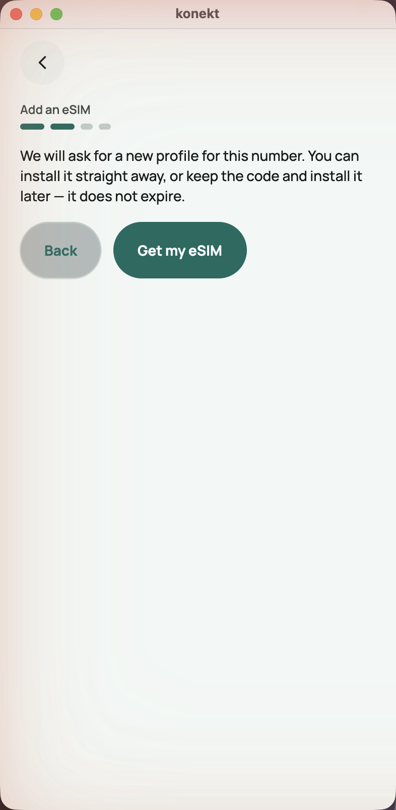
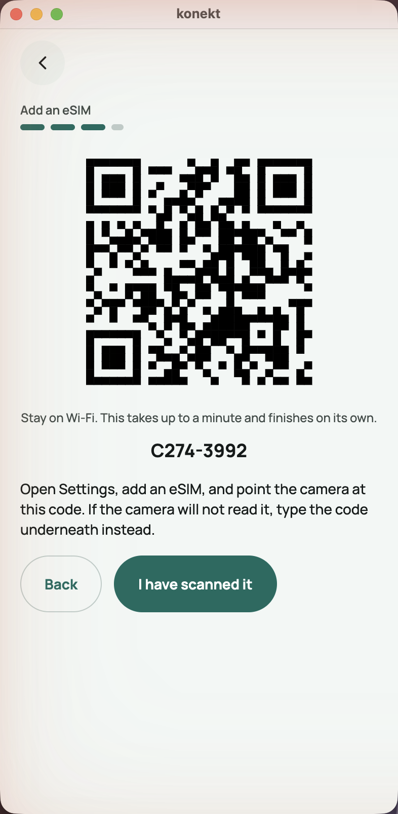
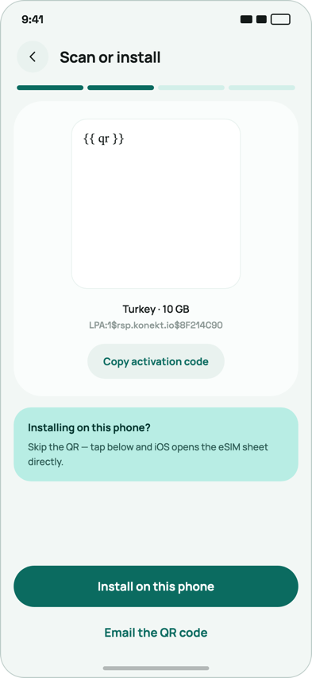
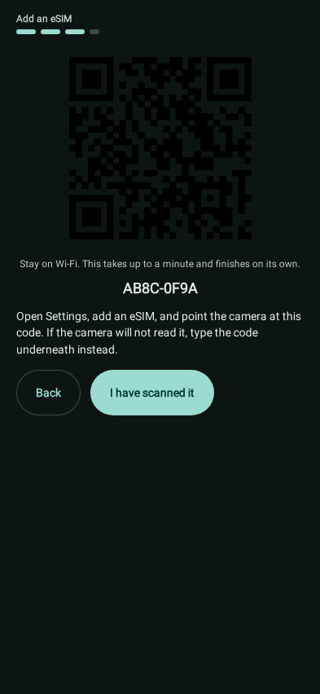
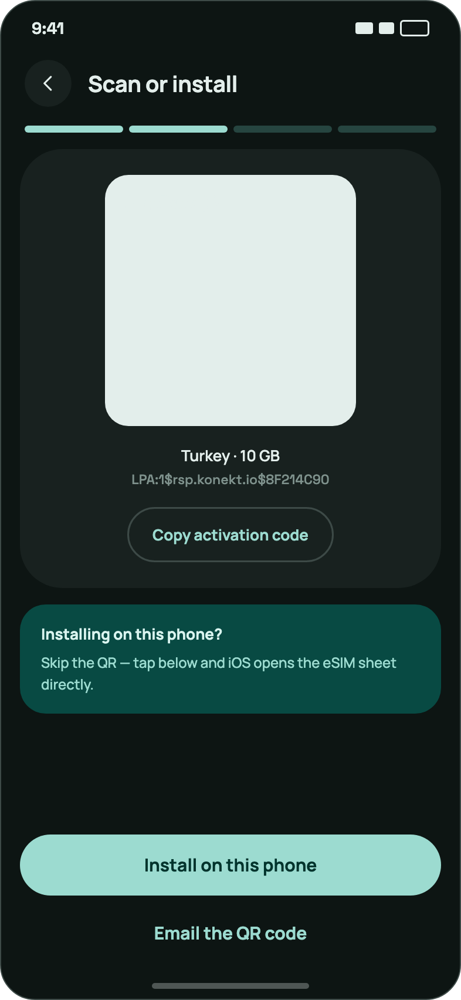
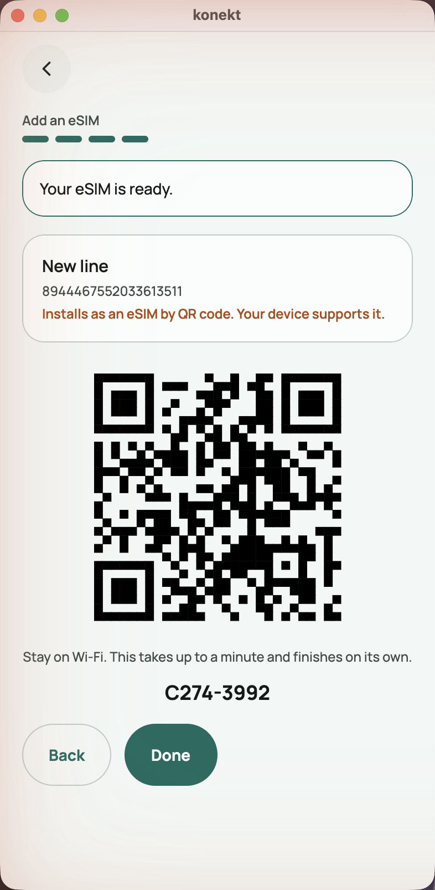
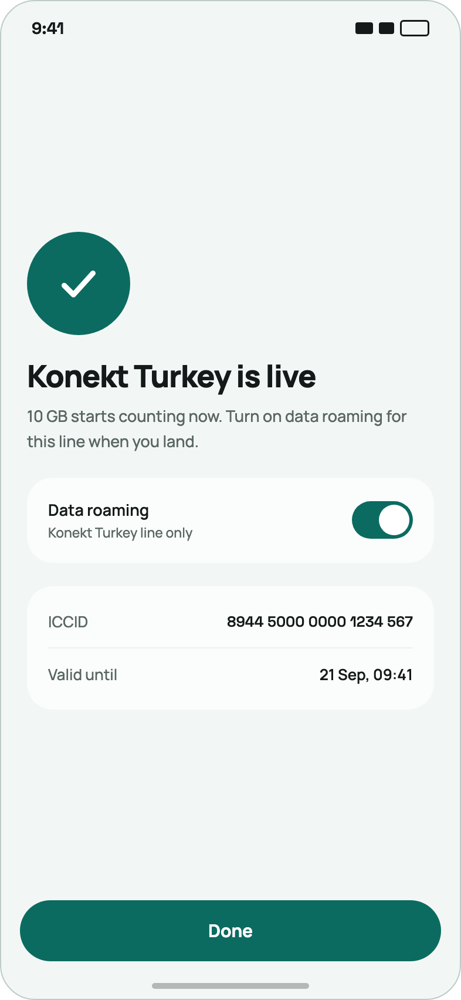

# B-115 — The eSIM install flow, as it is beside as it should be

Reported from the running desktop client after [B-114](B-114-the-client-does-not-look-like-the-canvas.md)
had landed: *the install flow's design is crooked.* B-114 walked every screen the canvas draws and
never opened the wizard — it is reached from the home banner, which a line with an eSIM already
installed does not show, and the audit's account had one. This item is the same comparison for the
four steps of section 04 of the canvas, done the same way: the real application at 393×852 on the
test contour beside the real canvas frames, and the list of what has to move.

## How the comparison was made

A fresh number on the test contour (`v0.1.39`), money and a plan given through the API, the wizard
entered from the home banner and walked to `done`. Every application frame is a screenshot of that
window, captured over the same rectangle B-114 used; every reference frame is the canvas rendered at
393×852 with its own fonts. The dark frame is the golden `AppFrame_App_esim_activate_Dark` as it was before this item, because
the window was not switched — and it is the frame with the one defect that is not cosmetic.

## What is deliberately NOT on the list

| In the canvas | Why it stays different |
|---|---|
| The checklist on step one — `Device supports eSIM · iPhone 14 Pro`, `Carrier lock · Unlocked`, `Free eSIM slots · 1 of 8 left` | three facts about the device, and the server knows none of them: the client runs on a desktop and on phones alike and reports nothing about itself. The one fact that exists — the slot limit — is the refusal banner on the same step ([screen-esim-wizard §6](../screens/screen-esim-wizard.md)), stated when it happens rather than predicted |
| `Install on this phone` and *"Skip the QR — tap below and iOS opens the eSIM sheet directly"* | an LPA deep link into the operating system's own sheet; there is no such door on a desktop and no iOS build wires one. The QR and the typed code are the whole of what this build can offer |
| `Activating the line` — *Profile downloaded · Registering on Turkcell · Enabling data* | live activation telemetry from a real SM-DP+ and a real network, which `MockSmDpPlus` does not produce. The step exists here as `activate` = the QR; the canvas's third frame is a state this product cannot observe |
| The `Data roaming` toggle on the last frame | an iOS setting, not the product's |
| `Email the QR code` | no mail exists ([reference-scope](../services/reference-scope.md)) |
| The four steps themselves — ours are `check → confirm → activate → done`, the canvas's are *Before you start → Scan or install → Activating → Live* | the steps are the server's state machine (`EsimWizardSteps`) and the canvas's are a phone's; what CAN match is how a step is dressed, which is everything below |

## Across every step

These are not per-step defects; fix them once and every frame moves.

| | As it is | As it should be |
|---|---|---|
| **W1 — The header** | the shell's back chevron alone, on its own line, then a 12-point `Add an eSIM` label | a header row: a 44-point circle on the left — `×` on the first step, `‹` on the others — and the step's **title** beside it in `title_large`: *Install eSIM*, *Scan or install*. The shell draws the circle; the wizard has to supply the title and say which glyph |
| **W2 — Two backs** | the shell chevron AND a `Back` pill in the controls row, on every step after the first. The chevron leaves the wizard, the pill goes a step back; nothing on screen says which is which | one back: the header circle IS the wizard's back (`‹` = the `Back` transition, `×` on step one = leave). The `Back` pill goes. This needs the shell to let a screen own its back control — the way a `pinned` surface owns the footer since B-114 |
| **W3 — The step meter** | four dashes of 6×12 pt (24 when done), left-aligned under the label, in `primary` and `outline` | four **equal segments across the full width**, 8 tall, `primary` for done and `primary_container` for the rest, directly under the header — and then the eyebrow `STEP 1 OF 4` in `label_medium`, uppercase, `primary`, tracked. `step_meter` already carries `current`/`total`; the eyebrow is the renderer's, the label `Add an eSIM` is not in the canvas |
| **W4 — Title and body** | the step's paragraph in `body_medium`, and no heading — the screen opens on prose | a `headline_medium` heading per step (*Before you start*, *Scan or install*, *Your eSIM is live*) and the paragraph under it in `body_large` `on_surface_variant`. The heading is the server's copy — one `text` per step |
| **W5 — The controls** | `Back` + forward as two wrap-width pills, left-aligned, in the content flow right under the paragraph | one forward pill, **full width, pinned above the bottom edge** — the same `pinned` surface the plan page uses; a secondary way (`Email the QR code`) as a `link` under it. Nothing else in the row |
| **W6 — Cards** | the QR, the code and the paragraph sit straight on the page ground; the eSIM card has an outline | the canvas puts each block on a `surface` card: the QR in a white tile inside a card, the checklist/table in a card with `dividers`, the note in a `surface_variant` card. B-114 G2 applies unchanged |

## Step by step

### Step 1 — `check` / *Before you start*

| As it is | As it should be |
|---|---|
|  |  |

- W1, W3, W4, W5. The paragraph — *"An eSIM is a profile your phone downloads…"* — is right in
  substance and becomes the body under a *Before you start* heading; the canvas's own body (*"Install
  over Wi-Fi and keep your current SIM in place. The eSIM is added as a second line."*) is shorter and
  says the two things that matter — either copy, but one heading over it.
- The checklist card is out (see the top). The **slot-limit refusal**, when it comes, is a `banner`
  above the paragraph today; in the canvas it is the third row of the checklist with the amber `!`
  disc and the sentence in the amber. With no checklist, the banner stays — but as the canvas's
  amber row: an `icon` disc in the `low` tone beside the sentence, inside a card, not a bordered
  banner over the content.
- `Continue` → *Show QR code* is the canvas's word; ours is honest about the `confirm` step in
  between, so `Continue` stays — full width, pinned.

### Step 2 — `confirm`

| As it is | As it should be |
|---|---|
|  | *(no frame — the canvas has no confirm step)* |

- The step exists because issuing the profile is the irreversible act and the canvas's *Show QR code*
  does it silently; keep it, dress it as the others: heading *Get your eSIM*, the paragraph, one
  pinned pill *Get my eSIM*. W1–W5.
- `Back` pill out (W2).

### Step 3 — `activate` / *Scan or install*

| As it is | As it should be |
|---|---|
|  |  |
|  |  *(dark)* |

- **The QR in dark mode is black modules on a near-black page** — the golden above. A camera does not
  read it. The canvas keeps the QR on a **light tile** (`#E6EFEC`-ish) inside the dark card, and the
  tile is what the phone scans. `EsimQrRenderer` draws `Color.Black` on whatever the ground is; it
  has to draw on its own light tile, in both themes — the one item here that is a defect and not a
  look.
- The QR sits in a **white rounded tile inside a card**, centred, with the plan name (`Turkey · 10
  GB`) under it in `title_small` and the activation code under that in the mono face, grey. Ours:
  the QR raw on the page, the caption, then the typed code in `title_medium` bold and a paragraph.
  Fixes: the tile and the card (W6); the typed code as the canvas's small mono line, not a headline;
  the plan name over it — the server knows it (`esim.planTitle`, or the order's).
- **`Copy activation code`** as a tonal pill under the code. There is no copy action on the wire
  today; a `copy` action carrying the text is the smallest addition, and on a desktop it is the one
  thing more useful than a QR. A decision, listed rather than assumed.
- The paragraph (*"Open Settings, add an eSIM, and point the camera…"*) becomes the body under the
  *Scan or install* heading — the canvas's mint note (*Installing on this phone?*) is the iOS-only
  half and is out (see the top). The Wi-Fi caption stays on the QR.
- W5: `I have scanned it` full width, pinned; `Back` out.

### Step 4 — `done` / *… is live*

| As it is | As it should be |
|---|---|
|  |  |

- The canvas's outcome is the purchase result's shape (B-114 block 2): the **check disc** (`icon`),
  a `headline_medium` — *Konekt Turkey is live* / ours: *Your eSIM is ready* — one paragraph (*"10
  GB starts counting now…"*), and a **table** with `dividers`: `ICCID · 8944 5000 0000 1234 567`,
  `Valid until · 21 Sep, 09:41`. Ours opens on a bordered `banner` and an outlined `esim_card`.
- **The status sentence is drawn in an alarm colour**: *"Installs as an eSIM by QR code. Your device
  supports it."* comes out red-orange, because `EsimCardRenderer` colours `READY` as `secondary` and
  the state word reads as a warning. On the done step the sentence is good news; the card's accent
  should follow the same rule the counters follow — the state's container tone, and a `ready` state
  is not the amber one.
- The ICCID **grouped in fours** in the mono face, as the canvas and every SIM tray print it; ours is
  nineteen digits run together in `body_small`. The grouping is the server's (`manualCodeOf` already
  chunks the activation code); a `mono` flag or a `label_large`-mono style is the client's.
- **The QR again**, on purpose ([screen-esim-wizard §6](../screens/screen-esim-wizard.md)) — keep it,
  but below the table and inside its tile, not raw between the card and the buttons; the canvas has
  no second QR, so this is ours to place.
- W5: `Done` full width, pinned; `Back` out — going back from `done` reissues nothing and confuses
  everything.

## The order to do it in

1. **The dark QR tile** — the defect. One renderer, both themes, a golden that shows a light tile
   on the dark page.
2. **W1 + W2 + W5** — the header with the wizard's own back/close, and the pinned footer. This is the
   shell change: a screen that owns its back control, the way it owns its footer since B-114. Decide
   the wire shape first (the smallest: the wizard's `Back`/close button marked as the header control,
   the shell pulls it out and draws it in the circle's place with the title beside it).
3. **W3 + W4 + W6** — the meter, the eyebrow, the headings, the cards. Server copy per step, one
   renderer for the meter, the QR tile, the eSIM card's colour rule.
4. **The done step** as the outcome shape, the ICCID table, the copy action decision.

## Progress

### 1 — the dark QR tile, done

`EsimQrRenderer` paints a fixed light tile (`QR_LIGHT`, the canvas's mint-grey) under the quiet zone
and the modules, in both themes. The renderer's own comment had promised "black on white" and
delivered black on whatever the page was. The test renders the code on a painted dark page and
reads the quiet zone's pixels — on the harness's white window it would have passed without the
tile, which is how the frame went out; by mutation, removing the tile fails it.

### 2 — the header, one back, the pinned way forward (W1, W2, W5), done

`screen_header` went on the wire: a title and one control, a chevron that presses the action it
carries or a cross that leaves. The shell pulls it out of the tree like the bar and the pinned
footer and draws it in its chevron's place — `ScreenHeaderIsTheBackControlTest` presses the circle
and watches the wizard's own step-back reach the host, with no second control on the screen. The
wizard sends it first on every step (`×` on `check`, `‹` with `Back` on the middle two, `×` with
`Finish` on `done`) and pins its one forward button full width. The `Back` pill is gone, and the
tests that walked columns and rows for it now use the dictionary's walk, which descends a surface.

## Acceptance criteria

- AC: every step has a golden at 393×852 in both themes, re-recorded from the server; the dark QR
  frame shows the code on a light tile.
- AC: one back control per step, and `BackControlTest`-style coverage that the wizard's step-back is
  what the header circle presses.
- AC: each wire change (the header control, a `copy` action, the plan title on the QR step, a mono
  style) is priced in [operator-boundaries](../services/operator-boundaries.md) as it lands.
- AC: [screen-esim-wizard](../screens/screen-esim-wizard.md) §4 describes what is drawn afterwards,
  and [design-app-canvas](../design/design-app-canvas.md) lists the deliberate differences above.

## Anchors

| What | Where |
|---|---|
| The frames | `docs/design/audit-2026-09-02/app/13-esim-*.png`, `docs/design/audit-2026-09-02/design/11.png`–`15.png` |
| The wizard's tree | `feature/esim-server-data/src/main/kotlin/io/konekt/feature/esim/server/data/EsimWizardScreen.kt` |
| The meter, the QR, the card | `client/src/commonMain/kotlin/io/konekt/client/render/FeedbackRenderers.kt`, `client/src/commonMain/kotlin/io/konekt/client/render/EsimQrRenderer.kt`, `client/src/commonMain/kotlin/io/konekt/client/render/ListRenderers.kt` |
| The shell's chevron and footer | `client/src/commonMain/kotlin/io/konekt/client/app/KonektApp.kt`, `client/src/commonMain/kotlin/io/konekt/client/app/KonektShell.kt` |
| The parent audit | [B-114](B-114-the-client-does-not-look-like-the-canvas.md) |
